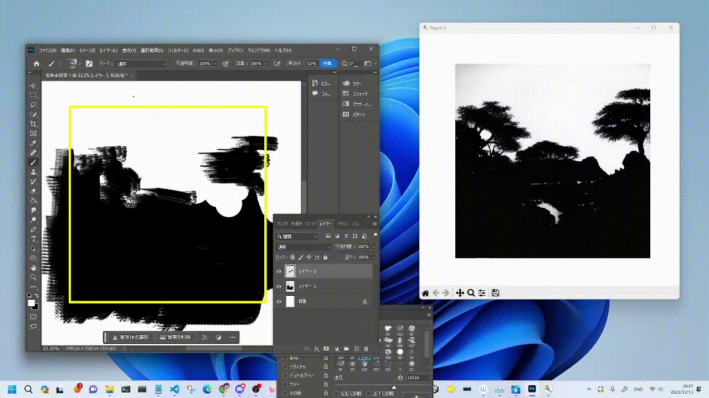

# StreamDiffusion

<p align="center">
  
  
</p>

# StreamDiffusion: A Pipeline-Level Solution for Real-Time Interactive Generation

**Authors:** [Akio Kodaira](https://www.linkedin.com/feed/), [Chenfeng Xu](https://www.chenfengx.com/), Toshiki Hazama, Takanori Yoshimoto, [Kohei Ohno](https://www.linkedin.com/in/kohei--ohno/), [Shogo Mitsuhori](https://me.ddpn.world/), Soichi Sugano, Hanying Cho, [Zhijian Liu](https://zhijianliu.com/), [Kurt Keutzer](https://scholar.google.com/citations?hl=en&user=ID9QePIAAAAJ)


StreamDiffusionは、リアルタイム画像生成を目指して開発された、画期的な拡散モデルベースの画像生成パイプラインです。この技術は、従来の拡散モデルベースの画像生成手法を向上し性能向上を実現しました。

[](https://arxiv.org/abs/2312.12491)
[](https://huggingface.co/papers/2312.12491)


```bash
@article{kodaira2023streamdiffusion,
      title={StreamDiffusion: A Pipeline-level Solution for Real-time Interactive Generation},
      author={Akio Kodaira and Chenfeng Xu and Toshiki Hazama and Takanori Yoshimoto and Kohei Ohno and Shogo Mitsuhori and Soichi Sugano and Hanying Cho and Zhijian Liu and Kurt Keutzer},
      year={2023},
      eprint={2312.12491},
      archivePrefix={arXiv},
      primaryClass={cs.CV}
}
```

## インストール

### 環境構築

anaconda または pip で仮想環境を作成してください。

anaconda を用いる場合

```
conda create -n streamdiffusion python=3.10
conda activate streamdiffusion
```
pip を用いる場合
```
python -m venv .venv
# Windows
.\.venv\Scripts\activate
# Linux
source .venv/bin/activate
```

### Step1: PyTorch インストール

使用する GPU の CUDA のバージョンに合わせてインストールしてください。

CUDA 11.8
```
pip3 install torch==2.1.0 torchvision==0.16.0 xformers --index-url https://download.pytorch.org/whl/cu118
```
CUDA 12.1
```
pip3 install torch==2.1.0 torchvision==0.16.0 xformers --index-url https://download.pytorch.org/whl/cu121
```

詳しくは[こちら](https://pytorch.org/)


### Step2: StreamDiffusion のインストール

#### ユーザー向け
StreamDiffusion　をインストール
```
pip install git+https://github.com/cumulo-autumn/StreamDiffusion.git@main#egg=streamdiffusion
```
tensorrt をインストール
```
python -m streamdiffusion.tools.install-tensorrt
```

#### 開発者向け
```
git clone https://github.com/cumulo-autumn/StreamDiffusion.git
python setup.py develop easy_install streamdiffusion[tensorrt]
python -m streamdiffusion.tools.install-tensorrt
```

## 動作例

 [`examples`](./examples) からサンプルを実行できます。

|  |  |
|:--------------------:|:--------------------:|
|  |  |


## 使用方法

```python
import io
from typing import *

import fire
import PIL.Image
import requests
import torch
from diffusers import AutoencoderTiny, StableDiffusionPipeline
from tqdm import tqdm

from streamdiffusion import StreamDiffusion
from streamdiffusion.image_utils import pil2tensor, postprocess_image


def download_image(url: str):
    response = requests.get(url)
    image = PIL.Image.open(io.BytesIO(response.content))
    return image


def run(
    wamup: int = 10,
    iterations: int = 50,
    prompt: str = "1girl with brown dog ears, thick frame glasses",
    lcm_lora: bool = True,
    tiny_vae: bool = True,
    acceleration: Optional[Literal["xformers", "sfast", "tensorrt"]] = None,
):
    pipe: StableDiffusionPipeline = StableDiffusionPipeline.from_single_file("./model.safetensors").to(
        device=torch.device("cuda"),
        dtype=torch.float16,
    )
    stream = StreamDiffusion(
        pipe,
        [32, 45],
        torch_dtype=torch.float16,
    )

    if lcm_lora:
        stream.load_lcm_lora()
        stream.fuse_lora()

    if tiny_vae:
        stream.vae = AutoencoderTiny.from_pretrained("madebyollin/taesd").to(device=pipe.device, dtype=pipe.dtype)

    if acceleration == "xformers":
        pipe.enable_xformers_memory_efficient_attention()
    elif acceleration == "tensorrt":
        from streamdiffusion.acceleration.tensorrt import accelerate_with_tensorrt

        stream = accelerate_with_tensorrt(
            stream, "engines", max_batch_size=2, engine_build_options={"build_static_batch": True}
        )
    elif acceleration == "sfast":
        from streamdiffusion.acceleration.sfast import accelerate_with_stable_fast

        stream = accelerate_with_stable_fast(stream)

    stream.prepare(
        prompt,
        num_inference_steps=50,
    )

    image = download_image("https://github.com/ddpn08.png").resize((512, 512))
    input_tensor = pil2tensor(image)

    # warmup
    for _ in range(wamup):
        stream(input_tensor.detach().clone().to(device=stream.device, dtype=stream.dtype))

    results = []

    for _ in tqdm(range(iterations)):
        start = torch.cuda.Event(enable_timing=True)
        end = torch.cuda.Event(enable_timing=True)

        start.record()
        x_output = stream(input_tensor.detach().clone().to(device=stream.device, dtype=stream.dtype))
        postprocess_image(x_output, output_type="pil")[0]
        end.record()

        torch.cuda.synchronize()
        results.append(start.elapsed_time(end))

    print(f"Average time: {sum(results) / len(results)}ms")
    print(f"Average FPS: {1000 / (sum(results) / len(results))}")


if __name__ == "__main__":
    fire.Fire(run)

```

# 謝辞

</br>

[Aki](https://github.com/cumulo-autumn/),
[Ararat](https://github.com/AttaQ/),
[Chenfeng Xu](https://github.com/chenfengxu714/),
[ddPn08](https://github.com/ddPn08/),
[kizamimi](https://github.com/kizamimi/),
[ramune](https://github.com/YN35/),
[teftef](https://github.com/teftef6220/),
[Tonimono](https://github.com/mili-inch/),
[Verb](https://github.com/discus0434),

</br>

この GitHubリポジトリ にある動画と画像のデモは、[kohakuV2](https://civitai.com/models/136268/kohaku-v2)と[SD-Turbo](https://arxiv.org/abs/2311.17042)を使用して生成されました。

KohakuV2 モデルを提供していただいたKohaku BlueLeaf 様 ([@KBlueleaf](https://twitter.com/KBlueleaf))、[SD-Turbo](https://arxiv.org/abs/2311.17042)を提供していただいた[StabilityAI](https://ja.stability.ai/)様に心より感謝いたします。

KohakuV2 モデルは[Civitai](https://civitai.com/models/136268/kohaku-v2)と[HuggingFace](https://huggingface.co/stabilityai/sd-turbo)からダウンロードでき、[SD-Turbo](https://arxiv.org/abs/2311.17042)　Hugging Faceで使用可能です。