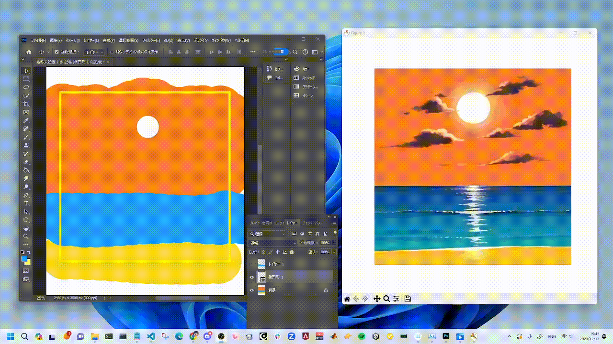
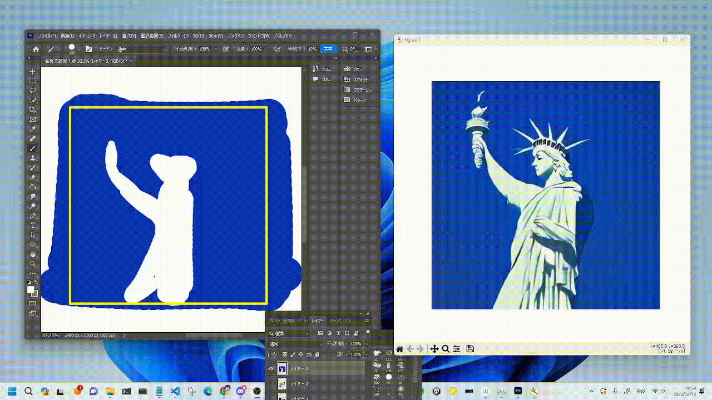

# StreamDiffusion

[English](./README.md) | [日本語](./README-ja.md)

<p align="center">
  
  
</p>

# StreamDiffusion: A Pipeline-Level Solution for Real-Time Interactive Generation

**Authors:** [Akio Kodaira](https://www.linkedin.com/feed/), [Chenfeng Xu](https://www.chenfengx.com/), Toshiki Hazama, Takanori Yoshimoto, [Kohei Ohno](https://www.linkedin.com/in/kohei--ohno/), [Shogo Mitsuhori](https://me.ddpn.world/), Soichi Sugano, Hanying Cho, [Zhijian Liu](https://zhijianliu.com/), [Kurt Keutzer](https://scholar.google.com/citations?hl=en&user=ID9QePIAAAAJ)


StreamDiffusionは、リアルタイム画像生成を実現するために最適化されたパイプラインです。従来の画像生成パイプラインと比べて飛躍的な速度向上を実現しました。

[](https://arxiv.org/abs/2312.12491)
[](https://huggingface.co/papers/2312.12491)

StreamDiffusionの開発にあたり、丁寧なサポート、有意義なフィードバックと議論をしていただいた [Taku Fujimoto](https://twitter.com/AttaQjp) 様と [Radamés Ajna](https://twitter.com/radamar) 様、そして Hugging Face チームに心より感謝いたします。

## 主な特徴

1. **Stream Batch** - [詳細](#stream-batching-link)
   - バッチ処理によるデータ処理の効率化

2. **Residual Classifier-Free Guidance** - [詳細](#residual-classifier-free-guidance-link)
   - 計算の冗長性を最小限に抑えるCFG

3. **Stochastic Similarity Filter** - [詳細](#stochastic-similarity-filtering-link)
   - 類似度によるフィルタリングでGPUの使用効率を最大化

4. **IO Queues** - [詳細](#io-queues-link)
   - 入出力操作を効率的に管理し、よりスムーズな実行を実現

5. **Pre-Computation for KV-Caches** - [詳細](#pre-computation-for-kv-caches-link)
   - 高速処理のためのキャッシュ戦略を最適化します。

6. **Model Acceleration Tools**
   - モデルの最適化とパフォーマンス向上のための様々なツールの利用

_Feel free to explore each feature by following the provided links to learn more about StreamDiffusion's capabilities. If you find it helpful, please consider citing our work:_

```bash
@article{kodaira2023streamdiffusion,
      title={StreamDiffusion: A Pipeline-level Solution for Real-time Interactive Generation},
      author={Akio Kodaira and Chenfeng Xu and Toshiki Hazama and Takanori Yoshimoto and Kohei Ohno and Shogo Mitsuhori and Soichi Sugano and Hanying Cho and Zhijian Liu and Kurt Keutzer},
      year={2023},
      eprint={2312.12491},
      archivePrefix={arXiv},
      primaryClass={cs.CV}
}
```

## インストール

### 環境構築

anaconda、pip、または後述するDockerで仮想環境を作成します。

anacondaを用いる場合

```bash
conda create -n streamdiffusion python=3.10
conda activate streamdiffusion
```

pipを用いる場合

```cmd
python -m venv .venv
# Windows
.\.venv\Scripts\activate
# Linux
source .venv/bin/activate
```

### Step1: PyTorchのインストール

使用するGPUのCUDAバージョンに合わせてPyTorchをインストールしてください。

CUDA 11.8

```bash
pip3 install torch==2.1.0 torchvision==0.16.0 xformers --index-url https://download.pytorch.org/whl/cu118
```

CUDA 12.1

```bash
pip3 install torch==2.1.0 torchvision==0.16.0 xformers --index-url https://download.pytorch.org/whl/cu121
```

詳しくは[こちら](https://pytorch.org/)


### Step2: StreamDiffusionのインストール

#### ユーザー向け

StreamDiffusionをインストール

```bash
pip install git+https://github.com/cumulo-autumn/StreamDiffusion.git@main#egg=streamdiffusion
```

TensorRTをインストール

```bash
python -m streamdiffusion.tools.install-tensorrt
```

#### 開発者向け

```bash
git clone https://github.com/cumulo-autumn/StreamDiffusion.git
python setup.py develop easy_install streamdiffusion[tensorrt]
python -m streamdiffusion.tools.install-tensorrt
```

### Dockerの場合(TensorRT対応)

```bash
git clone https://github.com/cumulo-autumn/StreamDiffusion.git
cd StreamDiffusion
docker build -t stream-diffusion:latest -f Dockerfile .
docker run --gpus all -it -v $(pwd):/home/ubuntu/streamdiffusion stream-diffusion:latest
```

## 動作例

[`examples`](./examples) からサンプルを実行できます。

|  |  |
|:--------------------:|:--------------------:|
|  |  |

具体的な詳細設定及びユーザカスタマイズは以下をお読みください。

## Real-Time Txt2Img Demo

リアルタイムのtxt2imgデモは [`demo/realtime-txt2img`](./demo/realtime-txt2img)にあります。

<p align="center">
  
</p>

## 使用例

```python
import torch
from diffusers import AutoencoderTiny, StableDiffusionPipeline
from diffusers.utils import load_image

from streamdiffusion import StreamDiffusion
from streamdiffusion.image_utils import postprocess_image

pipe = StableDiffusionPipeline.from_pretrained("KBlueLeaf/kohaku-v2.1").to(
    device=torch.device("cuda"),
    dtype=torch.float16,
)

# Wrap the pipeline in StreamDiffusion
stream = StreamDiffusion(
    pipe,
    t_index_list=[32, 45],
    do_add_noise=True,
    torch_dtype=torch.float16,
)

# If the loaded model is not LCM, merge LCM
stream.load_lcm_lora()
stream.fuse_lora()

# Use Tiny VAE for further acceleration
stream.vae = AutoencoderTiny.from_pretrained("madebyollin/taesd").to(device=pipe.device, dtype=pipe.dtype)

# Enable acceleration
pipe.enable_xformers_memory_efficient_attention()

prompt = "1girl with dog hair, thick frame glasses"

# Prepare the stream
stream.prepare(prompt)

# Prepare image
init_image = load_image("assets/img2img_example.png").resize((512, 512))

# Warmup >= len(t_index_list) x frame_buffer_size
for _ in range(2):
    stream(init_image)

# Run the stream infinitely
while True:
    x_output = stream(init_image)
    postprocess_image(x_output, output_type="pil")[0].show()
    input_response = input("Press Enter to continue or type 'stop' to exit: ")
    if input_response == "stop":
        break
```

### ベンチマーク

```python
from typing import Literal, Optional
from PIL import Image
import torch
from diffusers import AutoencoderTiny, StableDiffusionPipeline
from tqdm import tqdm

from streamdiffusion import StreamDiffusion
from streamdiffusion.image_utils import pil2tensor, postprocess_image


torch.set_grad_enabled(False)
torch.backends.cuda.matmul.allow_tf32 = True
torch.backends.cudnn.allow_tf32 = True


def run(
    prompt: str = "1girl with dog hair, thick frame glasses",
    warmup: int = 10,
    iterations: int = 50,
    lcm_lora: bool = True,
    tiny_vae: bool = True,
    acceleration: Optional[Literal["none", "xformers", "tensorrt"]] = "xformers",
):
    # Load Stable Diffusion pipeline
    pipe: StableDiffusionPipeline = StableDiffusionPipeline.from_pretrained(
        "KBlueLeaf/kohaku-v2.1"
    ).to(
        device=torch.device("cuda"),
        dtype=torch.float16,
    )

    # Wrap the pipeline in StreamDiffusion
    stream = StreamDiffusion(
        pipe,
        [32, 45],
        torch_dtype=torch.float16,
    )

    # Load LCM LoRA
    if lcm_lora:
        stream.load_lcm_lora()
        stream.fuse_lora()

    # Load Tiny VAE
    if tiny_vae:
        stream.vae = AutoencoderTiny.from_pretrained("madebyollin/taesd").to(
            device=pipe.device, dtype=pipe.dtype
        )

    # Enable acceleration
    if acceleration == "xformers":
        pipe.enable_xformers_memory_efficient_attention()
    elif acceleration == "tensorrt":
        from streamdiffusion.acceleration.tensorrt import accelerate_with_tensorrt

        stream = accelerate_with_tensorrt(
            stream,
            "engines",
            max_batch_size=2,
            engine_build_options={"build_static_batch": True},
        )

    # Prepare the stream
    stream.prepare(
        prompt,
        num_inference_steps=50,
    )

    # Prepare the input tensor
    image = Image.open("assets/img2img_example.png").convert("RGB").resize((512, 512))
    input_tensor = pil2tensor(image)

    # Warmup
    for _ in range(warmup):
        stream(
            input_tensor.detach().clone().to(device=stream.device, dtype=stream.dtype)
        )


    # Run the stream
    results = []
    for _ in tqdm(range(iterations)):
        start = torch.cuda.Event(enable_timing=True)
        end = torch.cuda.Event(enable_timing=True)

        start.record()
        x_output = stream(
            input_tensor.detach().clone().to(device=stream.device, dtype=stream.dtype)
        )
        image = postprocess_image(x_output, output_type="pil")[0]
        end.record()

        torch.cuda.synchronize()
        results.append(start.elapsed_time(end))

    print(f"Average time: {sum(results) / len(results)}ms")
    print(f"Average FPS: {1000 / (sum(results) / len(results))}")


if __name__ == "__main__":
    run()
```

## オプション

## Stochastic Similarity Filter


Stochastic Similarity Filterは動画入力時、前フレームからあまり変化しないときの変換処理を減らすことで、上のGIFの赤枠の様にGPUの負荷を軽減する。使用方法は以下のとおりである。

```
stream = StreamDiffusion(
        pipe,
        [32, 45],
        torch_dtype=torch.float16,
    )
stream.enable_similar_image_filter(similar_image_filter_threshold,similar_image_filter_max_skip_frame)
```

関数で設定できる引数として以下がある。
### similar_image_filter_threshold

- 処理を休止する前フレームと現フレームの類似度の閾値

### similar_image_filter_max_skip_frame

- 休止中に変換を再開する最大の間隔

## Residual CFG (RCFG)


RCFGはCFG使用しない場合と比較し、競争力のある計算量で近似的にCFGを実現させる方法である。StreamDiffusionの引数cfg_typeから指定可能である。

RCFGは二種類あり、negative promptの指定項目なしのRCFG Self-Negativeとnegative promptが指定可能なOnetime-Negativeが利用可能である。計算量はCFGなしの計算量をN、通常のCFGありの計算量を２Nとしたとき、RCFG Self-NegativeはN回で、Onetime-NegativeはN+1回で計算できる。

The usage is as follows:

```
# CFG なし
cfg_type = "none"

# 通常のCFG
cfg_type = "full"

# RCFG Self-Negative
cfg_type = "self"

# RCFG Onetime-Negative
cfg_type = "initialize"

stream = StreamDiffusion(
        pipe,
        [32, 45],
        torch_dtype=torch.float16,
        cfg_type = cfg_type
    )

stream.prepare(
        prompt = "1girl, purple hair",
        guidance_scale = guidance_scale,
        delta = delta,
    )
```

deltaはRCFGの効きをマイルドにする効果を持つ

# 開発チーム

[Aki](https://github.com/cumulo-autumn/),
[Ararat](https://github.com/AttaQ/),
[Chenfeng Xu](https://github.com/chenfengxu714/),
[ddPn08](https://github.com/ddPn08/),
[kizamimi](https://github.com/kizamimi/),
[ramune](https://github.com/YN35/),
[teftef](https://github.com/teftef6220/),
[Tonimono](https://github.com/mili-inch/),
[Verb](https://github.com/discus0434),

(*alphabetical order)
</br>

# 謝辞

この GitHubリポジトリ にある動画と画像のデモは、[LCM-LoRA](https://huggingface.co/latent-consistency/lcm-lora-sdv1-5) + [kohakuV2](https://civitai.com/models/136268/kohaku-v2)と[SD-Turbo](https://arxiv.org/abs/2311.17042)を使用して生成されました。

LCM-LoRAを提供していただいた[LCM-LoRA authors](https://latent-consistency-models.github.io/)、KohakuV2 モデルを提供していただいたKohaku BlueLeaf 様 ([@KBlueleaf](https://twitter.com/KBlueleaf))、[SD-Turbo](https://arxiv.org/abs/2311.17042)を提供していただいた[Stability AI](https://ja.stability.ai/)様に心より感謝いたします。

KohakuV2 モデルは [Civitai](https://civitai.com/models/136268/kohaku-v2) と [Hugging Face](https://huggingface.co/stabilityai/sd-turbo) からダウンロードでき、[SD-Turbo](https://arxiv.org/abs/2311.17042) は Hugging Faceで使用可能です。。


# Contributors

<!-- <a href="https://github.com/cumulo-autumn/StreamDiffusion/tree/dev/refactor-examples/graphs/contributors" target="_blank">
  
</a> -->
